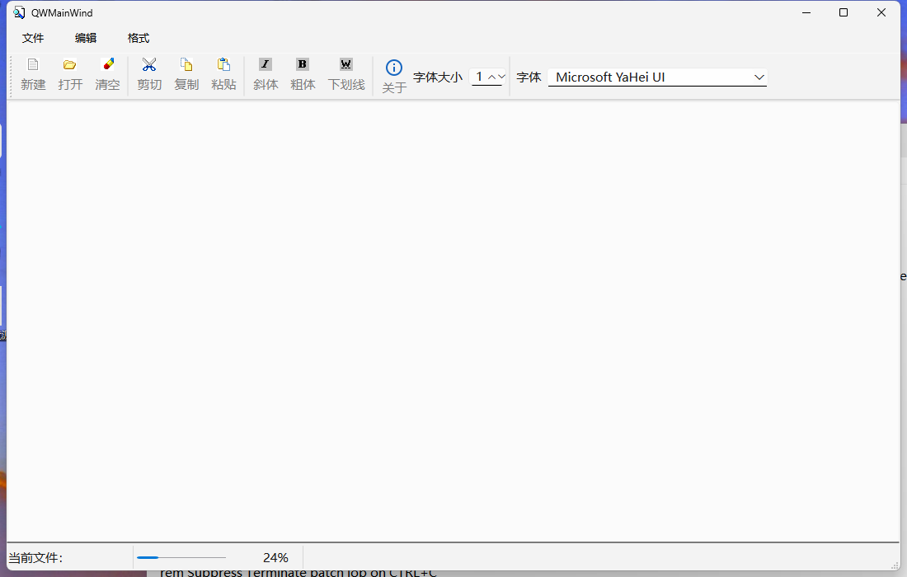
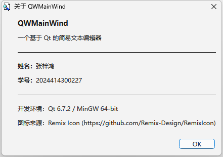

# QtCourse

《Qt 程序设计》课程作业仓库。



## 目录结构

```
QtCourse/
├── docs/                     # 运行截图
│   ├── screenshot-main.png
│   └── screenshot-about.png
└── samp2_4App/               # 示例 2-4：基于 Qt 的简易文本编辑器（教材示例 + 课后改造）
    ├── main.cpp
    ├── qwmainwind.h / .cpp / .ui
    ├── res.qrc
    ├── samp2_4.pro
    └── images/
```

## 作业内容

原程序是教材示例 2-4 的简易文本编辑器，具备新建 / 打开 / 剪切 / 复制 / 粘贴 /
清空 / 字体设置 / 粗体 / 斜体 / 下划线，以及状态栏提示、工具栏字体与字号控件等功能。

**本次改造：在主工具栏增加一个“关于”工具按钮，点击后弹出 About 对话框，显示姓名与学号。**



### 改动清单

| 文件 | 改动 |
| --- | --- |
| `qwmainwind.ui` | 新增 `actAbout` 动作，并加入到主工具栏末尾 |
| `qwmainwind.h` | 声明槽函数 `on_actAbout_triggered()` |
| `qwmainwind.cpp` | 实现 `on_actAbout_triggered()`，用 `QMessageBox::about()` 弹出对话框；新增 `#include <QMessageBox>` |
| `res.qrc` | 登记新图标 `images/about.svg` |
| `images/about.svg` | 取自 [Remix Icon](https://github.com/Remix-Design/RemixIcon) 的 `System/information-line` 图标 |

槽函数用 `on_<对象名>_<信号>` 的命名方式，由 Qt 的 `connectSlotsByName` 自动关联，无需手工 connect。

```cpp
void QWMainWind::on_actAbout_triggered()
{//点击工具栏“关于”按钮，弹出 About 对话框，显示作者姓名与学号
    QMessageBox::about(this, tr("关于 QWMainWind"),
        tr("<h3>QWMainWind</h3>"
           "<p>一个基于 Qt 的简易文本编辑器</p>"
           "<hr/>"
           "<p><b>姓名：</b>张梓鸿</p>"
           "<p><b>学号：</b>2024414300227</p>"
           "<hr/>"
           "<p>开发环境：Qt 6.7.2 / MinGW 64-bit</p>"
           "<p>图标来源：Remix Icon (https://github.com/Remix-Design/RemixIcon)</p>"));
}
```

## 开发环境

| 项目 | 版本 |
| --- | --- |
| Qt | 6.7.2 (MinGW 64-bit) |
| 编译器 | MinGW-w64 GCC 13.1.0 |
| 构建工具 | qmake + mingw32-make |
| 操作系统 | Windows 11 |

## 编译与运行

```bash
# 1. 生成 Makefile
mkdir build && cd build
qmake ../samp2_4App/samp2_4.pro

# 2. 编译
mingw32-make -f Makefile.Release -j4

# 3. 部署 Qt 运行库（复制到 release/ 目录，让 exe 可以脱离 Qt 环境直接双击运行）
windeployqt --release release/samp2_4.exe
# MinGW 运行时还需要手动复制这三个 DLL：
#   libgcc_s_seh-1.dll  libstdc++-6.dll  libwinpthread-1.dll

# 4. 运行
./release/samp2_4.exe
```

## 注意事项

1. **构建目录不要放在含中文的路径下**。MinGW 的 `windres` 与 Qt 的 `moc`
   在中文路径下会报 `can't open icon file ... Invalid argument` 之类的错误。
2. **源码目录里不要保留旧版 `ui_qwmainwind.h`**。它是 uic 的生成产物，
   如果残留在源码目录，会因 `-I` 搜索顺序的先后而遮蔽构建目录中新生成的文件，
   导致改了 `.ui` 却看不到效果。该文件已在 `.gitignore` 中忽略。

## 关于

- 姓名：张梓鸿
- 学号：2024414300227
